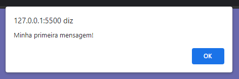
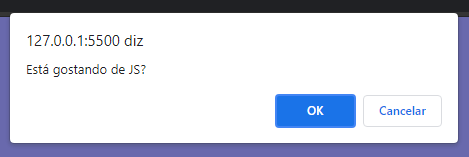
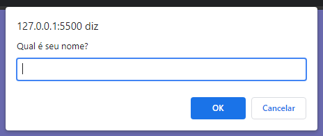

# Curso Javascript

## Aula 4 – Criando o seu primeiro script

Você já sabe diferenciar dentro do seu código, os trechos em HTML5, em CSS3 e em JavaScript? Sabe organizar as pastas do seu projeto dentro do Visual Studio Code? Sabe como testar se o Node.js está devidamente instalado? Já sabe utilizar os comandos alert, confirm e prompt do JavaScript?

https://youtu.be/OmmJBfcMJA8

A forma mais básica de se criar um script em JS é dentro da tag <body> antes do fechamento:

~~~html
<body>
    
Conteúdo em body

    
</body>
~~~

### Criando um alerta

Para criar um alerta utilizamos o seguinte comando:

~~~javascript
window.alert('mensagem')
~~~

​	ou

~~~javascript
alert('mensagem')
~~~

### Criando uma confirmação

Para criar uma confirmação utilizamos o seguinte comando:

~~~javascript
window.confirm('mensagem')
~~~

​	ou

~~~javascript
confirm('mensagem')
~~~

### Criando um prompt

Para criar um prompt utilizamos o seguinte comando:

~~~javascript
window.prompt('mensagem')
~~~

​	ou

~~~javascript
prompt('mensagem')
~~~

