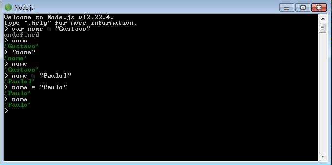
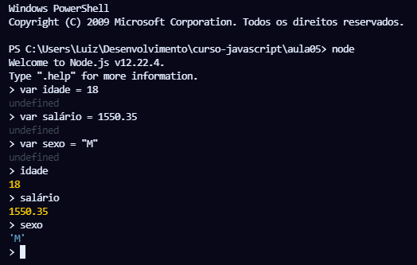
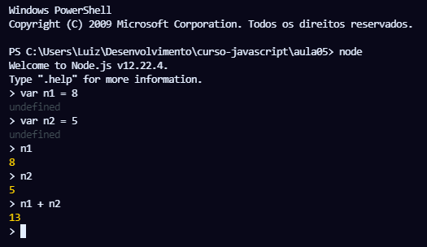

# Aula 5 – Variáveis e Tipos Primitivos

Você sabe o que são variáveis? Sabe declarar variáveis em JavaScript? Sabe quais são os tipos primitivos do JavaScript? Consegue entender o que significa colocar um valor null dentro de uma variável em JavaScript?

https://youtu.be/Vbabsye7mWo


## Comentários

// Comentários em uma linha

/*

​	Comentários em mais de uma linha

*/

------


## Variáveis	

Variáveis são espaços na memória do computador para guardar dados temporariamente.

Para criar uma variável no JavaScript é necessários usar o comando `var` acompanhando de um nome e uma atribuição

```javascript
var nomeDaVariavel = atribuição
```

*No JavaScript moderno além de usar a palavra `var`, também podemos usar as palavras `let` e `const`.*  

*O simbolo de **=** não é lido como "igual" mas sim como "recebe" pois no JavaScript é um sinal de atribuição e não de igualdade*.

*O nome da variável é chamado de identificador*.

### Regras dos Identificadores

* Podem começar com **letra**, **$** ou **_** ;
* Não pode começar com números;
* É possível usar **letras** ou **números**;
* É possível utilizar **acentos** e **símbolos**;
* Não podem conter **espaços**;
* Não podem ser **palavras reservadas**.

### Dicas para criação de Identificadores

* **Maiúsculas** e **minúsculas** fazem diferença;
* Tente escolher **nomes coerentes** para as variáveis;
* Evite se tornar um **"programador alfabeto"** ou um **"programador contador"**;

------


## Usando Javascript no terminal com Node

Basta abrir o node diretamente no terminal do node, no cmd ou no terminal do Visual Studio Code. Nestes dois últimos é necessário abrir com o comando `node`.

*No node podemos usar os comandos `ctrl+l` para limpar e `.exit` para sair do terminal.*

### Terminal Node



### Terminal Visual Studio Code





------


## Tipos Primitivos

### number

| Exemplos           |
| ------------------ |
| 5 18 -12           |
| 0.5 -15.9 3.14 8.0 |

#### Infinity

#### NaN

### string

| Exemplos     |
| ------------ |
| "Google"     |
| 'JavaScript' |
| ` Maria `    |

### boolean

### null

### undefined

### object

#### array

### function

------


## Descobrindo o tipo de uma variável

Usando o comando `typeof` com  o nome da variável é possível descobrir o tipo dela:

```javascript
var n = 200
typeof n 
// number

n = "Google"
typeof n
// string

typeof 6
// number

typeof 6.5
// number

typeof "6.5"
// string

typeof []
// object

typeof {}
// object

typeof function(){}
// function

typeof undefined
// undefined

typeof NaN
// number

typeof Infinity
// number

typeof null
// object
```

