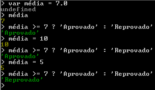
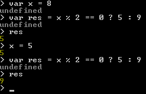
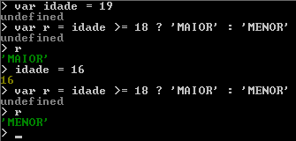

# Aula 8 – Operadores (Parte 2)

###### 18/08/2021

Você já conhece os operadores relacionais e os operadores lógicos em JavaScript? Sabe a diferença entre usar = ou == ou === em JavaScript? Conhece a ordem de precedência dos operadores do JavaScript? Sabe como usar o operador ternário para atribuições em JavaScript?

------


## Relacionais

| Operador |      Função      |
| :------: | :--------------: |
|  **>**   |    Maior que     |
|  **<**   |    Menor que     |
|  **>=**  | Maior ou igual a |
|  **<=**  | Menor ou igual a |
|  **==**  | Igual |
|  **!=**  | Diferente |
|*O resultado de uma operação realizada com operadores relacionais vai ser um valor booleano, isto é, 'true' ou 'false'.*||

~~~javascript
5 > 2 // true
7 < 4 // false
8 >= 8 // true
9 <= 7 // false
5 == 5 // true
4 != 4 // false

var a = 8
var b = 15
a > b // false (8 > 15)
a < b // true (8 < 15)
a >= b - 10 // false (8 <= 15 - 10)
~~~

### Identidade

~~~javascript
5 == 5 // true
5 == '5' // true
5 === '5' // false
5 === 5 // true
~~~
*O operador relacional não testa o tipo, apenas analisa se os dois valores são iguais ignorando os tipos*
*O operador de igualdade restrita **===** analisa se os valores são identicos contando também com o tipo*


## Lógicos

|   Operador    |  Função   |
| :-----------: | :-------: |
|     **!**     |  Negação  |
| **&&** (and)  | Conjunção |
| **\|\|** (or) | Disjunção |

**And**
true **&&** true  **true**
true **&&** false  **false**
false **&&** true  **false**
false **&&** false  **false**
*Os dois valores precisam ser verdadeiros*


**Or**

true **||** true  **true**
true **||** false  **true**
false **||** true  **true**
false **||** false  **false**
*Basta um valor ser verdadeiro*


## Ordem de Precedência dos Operadores

Aritméticos - **()** ****** **/**  ..

Relacionais - **> < >=** ... (Não tem ordem de precedência entre si, é feito da esquerda para direita)

Lógicos - **! && ||**


## Ternário

| Operador |    Função     |
| :------: | :-----------: |
|  **?**   | Se verdadeiro |
|  **:**   |   Se falso    |

~~~javascript
// teste ? true : false
média >= 7 ? 'Aprovado' : 'Reprovado'
~~~



```javascript
var x = 8
var res = x % 2 == 0 ? 5 : 9
```





