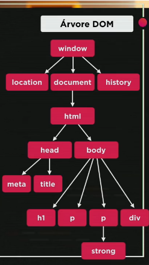

# Aula 9 – Introdução ao DOM

###### 19/08/2021

Você sabe o que significa a sigla DOM? Sabe para que serve o Document Object Model? Sabe como criar uma árvore DOM para o seu site? Sabe como usar o JavaScript para manipular o DOM? Sabe para que servem os elementos Parent e Child em um DOM? Sabe utilizar os métodos getElementByTagName, getElementById, getElementByName, getElementByClassName, querySelector de acesso ao DOM no JavaScript?

------

## O que é?

DOM (Document Object Model), Modelo de Objetos para Documentos, é basicamente um conjunto de objetos dentro do navegador que dá acesso aos componentes internos do website, não funciona dentro do Node, apenas no navegador.

## Árvore DOM

## Selecionando

### **por Marca**

`getElementsByTagName()`

### por ID

`getElementById()`

### por Nome

`getElementsByName()`

### por Classe

`getElementsByClassname()`

### por Seletor

`querySelector()`

`querySelectorAll()`

