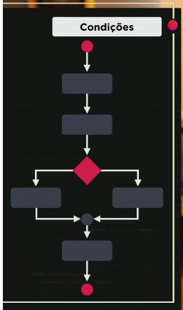

# Aula 11 – Condições (Parte 1)

Você sabe usar o comando if no JavaScript? Sabe diferenciar condições simples e condições compostas? Sabe como criar uma condição usando JavaScript? Sabe como instalar e configurar a extensão Node Exec no Visual Studio Code?

------

## Condições

As condições são utilizadas para executar um certo bloco de código, quando algo acontece ou quando não aconteça.

~~~javascript
if (condição) {
    // bloco de código que será executado caso a condição seja true
} else {
    // bloco de código que será executado caso a condição seja false
}
~~~

## Tipos de Condição

### Condição Simples

~~~javascript
if (condição) {
    // true
}
~~~

### Condição if/else

~~~javascript
if (condição) {
    // true
} else {
    // false
}
~~~

~~~javascript
var vel = 12
console.log(`A velocidade do seu carro é ${vel}Km/h`)
if (vel > 60) { // condição simples
    console.log('Você ultrapassou a velocidade permitida. MULTADO!')
}
console.log('Dirija sempre usando cinto de segurança')
~~~

~~~javascript
var país = 'Brasil'
console.log(`Vivendo em ${país}`)

if (país != 'Brasil') {
    console.log('Você é Estrangeiro')
} else {
    console.log('Você é Brasileiro!')
}
~~~

