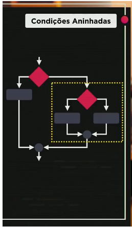
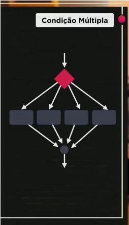

# Aula 12 – Condições (Parte 2)

Você sabe mudar a cor de fundo de um site, dinamicamente, usando JavaScript? Sabe como inserir uma imagem usando JavaScript em um site, sem ter a tag img previamente definida? Sabe como utilizar condições simples (if), condições compostas (if..else), condições aninhadas (if..elseif..else) e condições múltiplas (switch..case) em JavaScript?

------

## Condições Aninhadas

São condições que acontecem dentro de outras condições.

~~~javascript
// método 1
if (cond1) {
    // bloco 1
} else {
    if (cond2) {
        // bloco 2
    } else {
        // bloco 3
    }
}

// método 2
if (cond1) {
    //bloco 1
} else if (cond2) {
    // bloco 2
} else {
    //bloco 3
}
~~~

~~~javascript
var idade = 67

console.log(`Você tem ${idade} anos`)

if (idade < 16) {
    console.log('Não vota')
} else if (idade >= 16 && idade < 18 || idade > 65) {
    console.log('Voto opcional')
} else {
    console.log('Voto obrigatório')
}
~~~

### Obtendo horário atual com JavaScript

Usando a função Date() podemos obter tanto data como hora no JavaScript:

~~~javascript
var agora = new Date()
var hora = agora.getHours()
~~~
*Usando o Date() com o método getHours() podemos obter o horário atual*

## Condição Múltipla

Usada para trabalhar com valores fixos.

~~~javascript
switch (expressão) {
    case valor 1:
        
        break
    case valor 2:
        
        break
    case valor 3:
        
        break
    default:
        
        break
}
~~~

É melhor usa o switch para valores pontuais, nos caso de calcular intervalos é mais recomendável usar o if.
